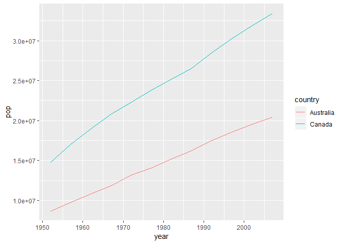

hw02
================

### Step 1: Smell test the data

Load the data set and try to figure out what the data set looks like.

``` r
library(gapminder)
library(tidyverse)
```

    ## -- Attaching packages ----------------------- tidyverse 1.2.1 --

    ## √ ggplot2 3.0.0     √ purrr   0.2.5
    ## √ tibble  1.4.2     √ dplyr   0.7.6
    ## √ tidyr   0.8.1     √ stringr 1.3.1
    ## √ readr   1.1.1     √ forcats 0.3.0

    ## -- Conflicts -------------------------- tidyverse_conflicts() --
    ## x dplyr::filter() masks stats::filter()
    ## x dplyr::lag()    masks stats::lag()

``` r
typeof(gapminder)
```

    ## [1] "list"

``` r
class(gapminder)
```

    ## [1] "tbl_df"     "tbl"        "data.frame"

``` r
ncol(gapminder)
```

    ## [1] 6

``` r
nrow(gapminder)
```

    ## [1] 1704

``` r
length(gapminder)
```

    ## [1] 6

``` r
str(gapminder)
```

    ## Classes 'tbl_df', 'tbl' and 'data.frame':    1704 obs. of  6 variables:
    ##  $ country  : Factor w/ 142 levels "Afghanistan",..: 1 1 1 1 1 1 1 1 1 1 ...
    ##  $ continent: Factor w/ 5 levels "Africa","Americas",..: 3 3 3 3 3 3 3 3 3 3 ...
    ##  $ year     : int  1952 1957 1962 1967 1972 1977 1982 1987 1992 1997 ...
    ##  $ lifeExp  : num  28.8 30.3 32 34 36.1 ...
    ##  $ pop      : int  8425333 9240934 10267083 11537966 13079460 14880372 12881816 13867957 16317921 22227415 ...
    ##  $ gdpPercap: num  779 821 853 836 740 ...

### Step 2: Explore individual variables

``` r
summary(gapminder$continent) 
```

    ##   Africa Americas     Asia   Europe  Oceania 
    ##      624      300      396      360       24

Take all countries in Europe that have a GDP per capita greater than
40000, and select all variables except gdpPercap.

``` r
gapminder %>%
  filter(gdpPercap>40000 & continent=="Europe") %>% 
  select(-gdpPercap) %>% 
  knitr::kable()
```

| country | continent | year | lifeExp |     pop |
| :------ | :-------- | ---: | ------: | ------: |
| Ireland | Europe    | 2007 |  78.885 | 4109086 |
| Norway  | Europe    | 1997 |  78.320 | 4405672 |
| Norway  | Europe    | 2002 |  79.050 | 4535591 |
| Norway  | Europe    | 2007 |  80.196 | 4627926 |

### Step 3: Explore various plot types

  - **Scatter plot**

Look at the relationship between gdpPercap and lifeExp.

``` r
gapminder %>% 
    filter(continent=="Europe") %>% 
    ggplot(aes(x=log(gdpPercap), y=lifeExp))+
    geom_point()
```

<!-- -->

Obviously, higher gdp per capita usually leads to longer lifetime in
Europe.

  - **Density plot**

Show the distribution of population in each continent.

``` r
library(tidyverse)
gapminder %>% 
    ggplot(aes(pop,fill= continent))+
    scale_x_log10()+
    geom_histogram(bins=20)
```

<!-- -->

It can be concluded that Africa accounts for the highest pencentage of
population in the world. And there is a high variance of population in
Asia.

  - **Line plot**

Focus on the trend of population of each city in Europe and Asia.

``` r
gapminder %>%  
  filter(continent=="Asia"|continent=="Europe") %>% 
  ggplot(aes(year, pop, group=country, color=continent)) +
  scale_y_log10()+
  geom_line()
```

<!-- -->

These years the countries in Asia have seen a remarkable increase on
population. Whereas most of countries in Europe keep steady generally on
that.

### Go further

1.  Logical Operators

Get the data for Rwanda and Afghanistan.

``` r
filter(gapminder, country=="Rwanda"|country=="Afghanistan") %>% 
knitr::kable()
```

| country     | continent | year | lifeExp |      pop | gdpPercap |
| :---------- | :-------- | ---: | ------: | -------: | --------: |
| Afghanistan | Asia      | 1952 |  28.801 |  8425333 |  779.4453 |
| Afghanistan | Asia      | 1957 |  30.332 |  9240934 |  820.8530 |
| Afghanistan | Asia      | 1962 |  31.997 | 10267083 |  853.1007 |
| Afghanistan | Asia      | 1967 |  34.020 | 11537966 |  836.1971 |
| Afghanistan | Asia      | 1972 |  36.088 | 13079460 |  739.9811 |
| Afghanistan | Asia      | 1977 |  38.438 | 14880372 |  786.1134 |
| Afghanistan | Asia      | 1982 |  39.854 | 12881816 |  978.0114 |
| Afghanistan | Asia      | 1987 |  40.822 | 13867957 |  852.3959 |
| Afghanistan | Asia      | 1992 |  41.674 | 16317921 |  649.3414 |
| Afghanistan | Asia      | 1997 |  41.763 | 22227415 |  635.3414 |
| Afghanistan | Asia      | 2002 |  42.129 | 25268405 |  726.7341 |
| Afghanistan | Asia      | 2007 |  43.828 | 31889923 |  974.5803 |
| Rwanda      | Africa    | 1952 |  40.000 |  2534927 |  493.3239 |
| Rwanda      | Africa    | 1957 |  41.500 |  2822082 |  540.2894 |
| Rwanda      | Africa    | 1962 |  43.000 |  3051242 |  597.4731 |
| Rwanda      | Africa    | 1967 |  44.100 |  3451079 |  510.9637 |
| Rwanda      | Africa    | 1972 |  44.600 |  3992121 |  590.5807 |
| Rwanda      | Africa    | 1977 |  45.000 |  4657072 |  670.0806 |
| Rwanda      | Africa    | 1982 |  46.218 |  5507565 |  881.5706 |
| Rwanda      | Africa    | 1987 |  44.020 |  6349365 |  847.9912 |
| Rwanda      | Africa    | 1992 |  23.599 |  7290203 |  737.0686 |
| Rwanda      | Africa    | 1997 |  36.087 |  7212583 |  589.9445 |
| Rwanda      | Africa    | 2002 |  43.413 |  7852401 |  785.6538 |
| Rwanda      | Africa    | 2007 |  46.242 |  8860588 |  863.0885 |

“||” couldn’t achieve filter here. Since it evaluates left to right
examining only the first element of each vector.

``` r
filter(gapminder, country=="Rwanda"||country=="Afghanistan")
```

    ## # A tibble: 1,704 x 6
    ##    country     continent  year lifeExp      pop gdpPercap
    ##    <fct>       <fct>     <int>   <dbl>    <int>     <dbl>
    ##  1 Afghanistan Asia       1952    28.8  8425333      779.
    ##  2 Afghanistan Asia       1957    30.3  9240934      821.
    ##  3 Afghanistan Asia       1962    32.0 10267083      853.
    ##  4 Afghanistan Asia       1967    34.0 11537966      836.
    ##  5 Afghanistan Asia       1972    36.1 13079460      740.
    ##  6 Afghanistan Asia       1977    38.4 14880372      786.
    ##  7 Afghanistan Asia       1982    39.9 12881816      978.
    ##  8 Afghanistan Asia       1987    40.8 13867957      852.
    ##  9 Afghanistan Asia       1992    41.7 16317921      649.
    ## 10 Afghanistan Asia       1997    41.8 22227415      635.
    ## # ... with 1,694 more rows

2.  More dplyr: `group_by` and `transmute`

Sum over the population of each continent in 2007.

``` r
library(dplyr)
a <- group_by(gapminder, continent)  
a <- filter(a, year==2007)
a <- transmute(a, cum = cumsum(as.numeric(pop))) 
filter(a, cum==max(cum) ) %>% 
  knitr::kable()
```

| continent |        cum |
| :-------- | ---------: |
| Oceania   |   24549947 |
| Europe    |  586098529 |
| Americas  |  898871184 |
| Asia      | 3811953827 |
| Africa    |  929539692 |

`group_by` takes an existing tbl and converts it into a grouped tbl.

`transmute` adds new variables and drops existing variables.
